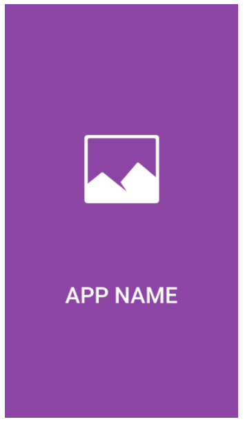
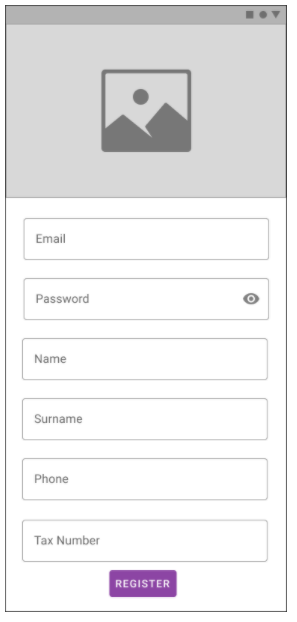
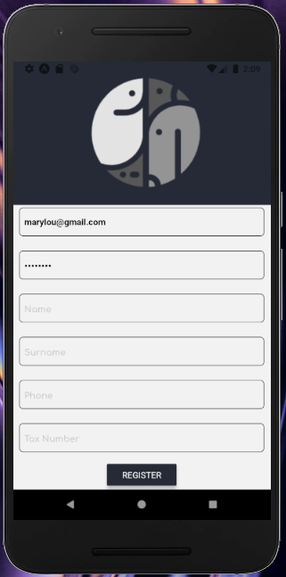
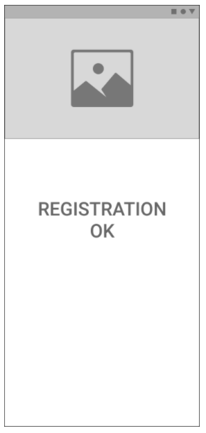
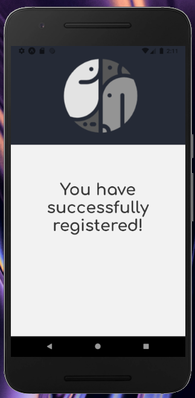

# Overview :ferris_wheel:

This App is my first React Native project :seedling: and it was built taking into consideration the instructions below:

### :pushpin: Splash screen:
- When the app opens, the splash should be displayed.
- When the user taps, the splash should open the Registration screen.
- After 2 seconds, the splash is automatically redirecting to the Registration screen.

### :pushpin: Registration screen:
- When the user taps on the bottom button, the form is validated and shows any error.
- If the form is correct, the app makes a call to the backend (mocked) and redirect to the Confirmation screen.

### :pushpin: Confirmation screen:
- Only shows a confirmation message.

### :pushpin: Others:
- The logo is the same in each page.
- The code is delivered in a new Github repo.

### :heavy_plus_sign: Technologies and resources used:
- Formik
- Yup
- Postman Mock Server

If you would like to see the final state of the app in action:
1. Clone the repository and... 
2. ... run it on the emulator or a phone: `yarn install` and `yarn start`

## :round_pushpin::bar_chart: Design

### Splash screen

<kbd>

</kbd>

### Registration screen

<kbd>

</kbd>

### Confirmation screen

<kbd>

</kbd>

